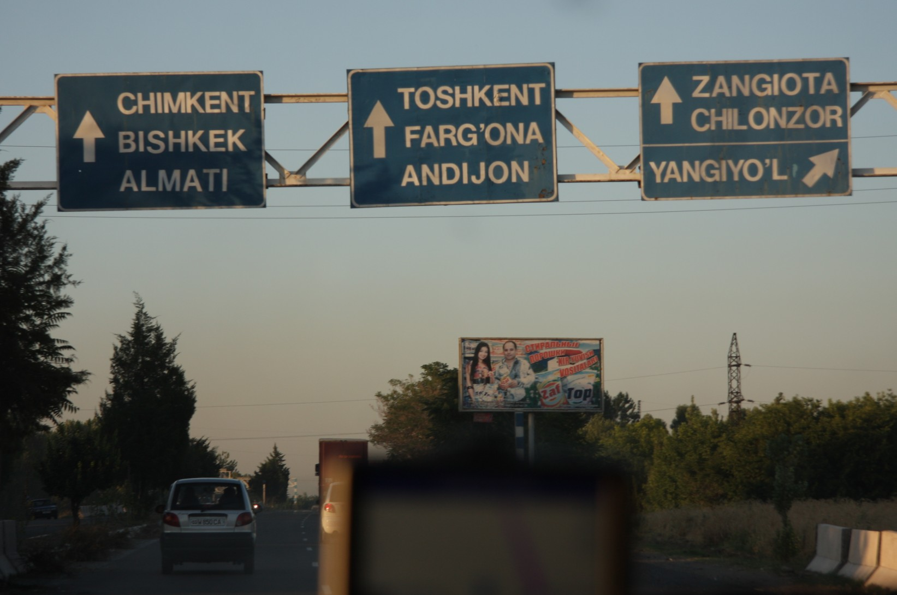
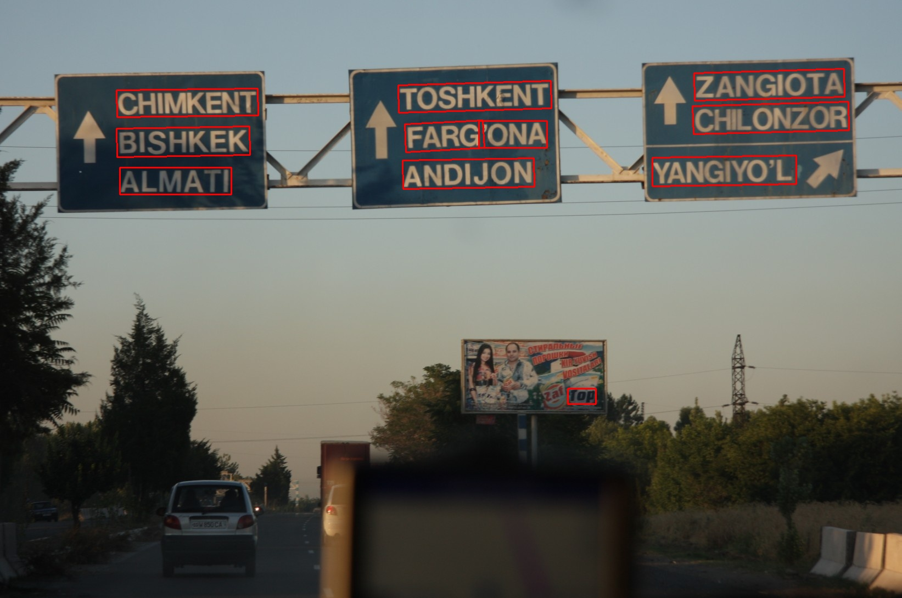
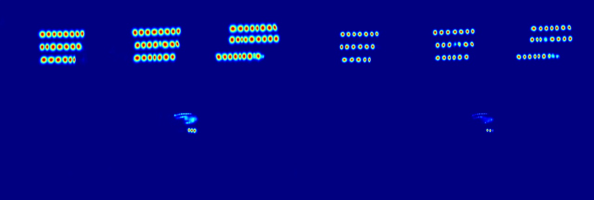

# CRAFT: Character-Region Awareness For Text Detection
[Official](https://github.com/clovaai/CRAFT-pytorch) Pytorch implementation of CRAFT text detector | [Paper](https://arxiv.org/abs/1904.01941) | [Pretrained Model](https://drive.google.com/open?id=1Jk4eGD7crsqCCg9C9VjCLkMN3ze8kutZ) |

## Run:
1. `git clone https://github.com/yakhyo/craft-text-detection-model`.
2. `mkdir weights`: make the `weights` folder inside the `craft-text-detection-model`.
3. Put some images into input folder.
4. Run the `test.py` file then the `result` folder will appear.
### Result:
Input image: 
Detection: 
Heatmap: 

## Notice:
1. `test.py` file is not the same with [official source](https://github.com/clovaai/CRAFT-pytorch) but does the same job.
 
- Thanks to the Clova AI Research team
## Reference

1. [CRAFT-pytorch](https://github.com/clovaai/CRAFT-pytorch)
